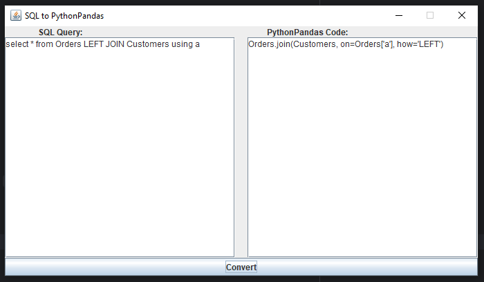

# Konwerter---SQL-Python-Pandas

***

## 1. Opis projektu

Celem tego projektu jest stworzenie translatora z SQL do biblioteki Pandas w Pythonie. Gramatyka jest pisana używając
Antlr 4. Może to być szczególnie przydatne dla analityków danych, którzy wolą pracować z SQL niż z komendami w Python
Pandas.

## 2. Struktura programu

- a

## 3. Interface



## 4. Tokeny oraz gramatyka

<details>
    <summary>Lista tokenów:</summary>
<ul>
<div>

```
fragment S : [sS];
fragment E : [eE];
fragment L : [lL];
fragment C : [cC];
fragment T : [tT];
fragment F : [fF];
fragment R : [rR];
fragment O : [oO];
fragment M : [mM];
fragment W : [wW];
fragment H : [hH];
fragment I : [iI];
fragment N : [nN];
fragment B : [bB];
fragment U : [uU];
fragment K : [kK];
fragment A : [aA];
fragment X : [xX];
fragment J : [jJ];
fragment D : [dD];
fragment P : [pP];
fragment G : [gG];
fragment V : [vV];
fragment Q : [qQ];
fragment Y : [yY];

SELECT: S E L E C T;
FROM: F R O M;
WHERE: W H E R E;
IN: I N;
BETWEEN: B E T W E E N;
LIKE: L I K E;
IS_NULL: I S WS? N U L L;
AS: A S;
JOIN: J O I N;
USING: U S I N G;
AND: A N D;
OR: O R;
ORDER_BY: O R D E R WS? B Y;
GROUP_BY: G R O U P WS? B Y;
INNER: I N N E R;
LEFT: L E F T;
RIGHT: R I G H T;
ASC: A S C;
DESC: D E S C;
COUNT: C O U N T;
SUM: S U M;
AVG: A V G;
MAX: M A X;
MIN: M I N;
LIMIT: L I M I T;
COMMA: ',';
LPAREN: '(';
RPAREN: ')';
DOT: '.';
NUMERICAL_VALUE: [0-9]+;
STRING_VALUE: '\'' (~['])* '\'';
IDENTIFIER: [a-zA-Z_][a-zA-Z0-9_]*;
WS: [ \t\r\n]+ -> skip;
```

</div>
</ul>
</details>


<details>
    <summary>Gramatyka:</summary>
<ul>
<div>

```
query
    : selectStatement (orderByStatement? groupByStatement? (LIMIT NUMERICAL_VALUE)?)?;


selectStatement
    : SELECT selectList FROM tableName whereClause? joinClause?;

selectList
    : '*'
    | selectItem (COMMA selectItem)*;

selectItem
    : columnReference
    | aggregateFunction;

whereClause
    : WHERE condition;
    
condition
    : expression
    | expression AND condition
    | expression OR condition
    | LPAREN condition RPAREN;

expression
    : columnReference operator value
    | columnReference operator columnReference
    | columnReference IN LPAREN valueList RPAREN
    | columnReference BETWEEN value AND value
    | columnReference LIKE value
    | columnReference IS_NULL;

valueList
    : value (COMMA value)*;

joinClause
    : joinType JOIN tableName USING selectList
    | joinClause AND joinType JOIN tableName USING selectList;

joinType
    : INNER
    | LEFT
    | RIGHT;

orderByStatement
    : ORDER_BY columnName (ASC | DESC)?;

groupByStatement
    : GROUP_BY columnReference (COMMA columnReference)*;

aggregateFunction
    : (COUNT | SUM | AVG | MAX | MIN) LPAREN columnReference RPAREN;

columnReference
    : (tableName DOT columnName)
    | columnName;

tableName
    : IDENTIFIER;

value
    : NUMERICAL_VALUE
    | STRING_VALUE;

columnName
    : IDENTIFIER;

operator
    : '=' | '!=' | '<' | '>' | '<=' | '>=';
```

</div>
</ul>
</details>

## 5. Przykłady działania

Przed:

```

```

Po:

```

```

## 6. Obsługa błędów

jakas

## 7. Instrukcja obsługi


